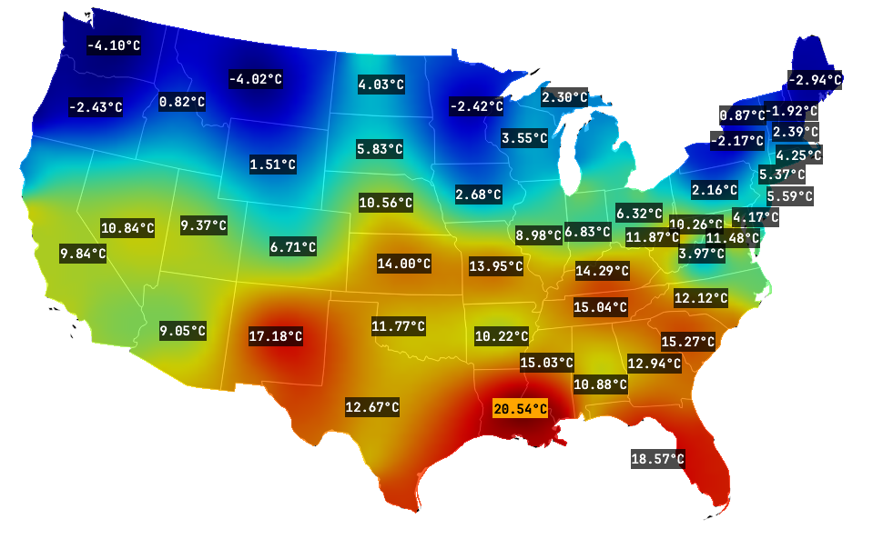

# FieldView

**FieldView** is a high-performance Python + Qt library for 2D data visualization, specifically designed for handling irregular data points. It uses `QtPy` to support **PySide6**, **PyQt6**, and **PyQt5**. It provides a robust rendering engine for heatmaps, markers, and text labels with minimal external dependencies.



## Key Features

*   **Fast Heatmap Rendering**: Hybrid RBF (Radial Basis Function) interpolation for high-quality visualization with real-time performance optimization.
*   **Irregular Data Support**: Native handling of non-grid data points.
*   **Polygon Masking**: Support for arbitrary boundary shapes (Polygon, Circle, Rectangle) to clip heatmaps.
*   **Layer System**: Modular architecture with support for:
    *   **HeatmapLayer**: Color-based data visualization.
    *   **ValueLayer/LabelLayer**: Text rendering with collision avoidance.
    *   **PinLayer**: Marker placement.
    *   **SvgLayer**: Background floor plans or overlays.
*   **Minimal Dependencies**: Built on `numpy`, `scipy`, and `qtpy`.

## Installation

```bash
pip install fieldview[pyside6]  # Install with PySide6
# OR
pip install fieldview[pyqt6]    # Install with PyQt6
# OR
pip install fieldview[pyqt5]    # Install with PyQt5

```

*Note: Requires Python 3.10+*

## Quick Start

Here is a minimal example to get a heatmap up and running:

```python
import sys
import os
import numpy as np
from qtpy.QtWidgets import QApplication, QGraphicsView, QGraphicsScene
from qtpy.QtGui import QPolygonF
from qtpy.QtCore import Qt, QPointF
from fieldview.core.data_container import DataContainer
from fieldview.layers.heatmap_layer import HeatmapLayer
from fieldview.layers.text_layer import ValueLayer
from fieldview.layers.svg_layer import SvgLayer
from fieldview.layers.pin_layer import PinLayer

app = QApplication(sys.argv)

# 1. Setup Data
data = DataContainer()
np.random.seed(44)

# Define rooms (x1, y1, x2, y2)
rooms = [
    (-450, -250, -150, 250), # Master Bed
    (-150, -250, 150, 250),  # Living
    (150, 0, 300, 250),      # Bed 2
    (300, -100, 450, 250)    # Bed 4
]

points = []
values = []

for i in range(20):
    room = rooms[np.random.randint(len(rooms))]
    x1, y1, x2, y2 = room
    margin = 20
    x = np.random.uniform(x1 + margin, x2 - margin)
    y = np.random.uniform(y1 + margin, y2 - margin)
    points.append([x, y])
    values.append(np.random.rand() * 100)
    
data.set_data(np.array(points), np.array(values))

# 2. Create Scene & Layers
scene = QGraphicsScene()

# SVG Layer (Background)
# Assuming floorplan_apartment.svg exists in current dir or provide path
svg_layer = SvgLayer()
svg_layer.load_svg("examples/floorplan_apartment.svg")
svg_layer.setZValue(0)
scene.addItem(svg_layer)

# Heatmap Layer
heatmap = HeatmapLayer(data)
heatmap.setOpacity(0.6)
heatmap.setZValue(1)

# Define custom boundary polygon for the apartment
polygon = QPolygonF([
    QPointF(-450, -330), QPointF(-300, -330), QPointF(-300, -250),
    QPointF(-150, -250), QPointF(-150, -300), QPointF(150, -300), 
    QPointF(150, -250), QPointF(450, -250), QPointF(450, 250), 
    QPointF(-450, 250)
])
heatmap.set_boundary_shape(polygon)

scene.addItem(heatmap)

# Pin Layer
pin_layer = PinLayer(data)
pin_layer.setZValue(2)
scene.addItem(pin_layer)

# Value Layer
values_layer = ValueLayer(data)
values_layer.setZValue(3)
scene.addItem(values_layer)

# 3. Setup View
view = QGraphicsView(scene)
view.resize(800, 600)
view.show()

# Ensure content is visible
scene.setSceneRect(scene.itemsBoundingRect())
view.fitInView(scene.sceneRect(), Qt.AspectRatioMode.KeepAspectRatio)

sys.exit(app.exec())
```
≈

## Running the Demo

To see all features in action, including the property editor and real-time interaction:

```bash
# Clone the repository
git clone https://github.com/yourusername/fieldview.git
cd fieldview

# Run the demo using uv (recommended)
uv run examples/demo.py
```


## License

MIT License
