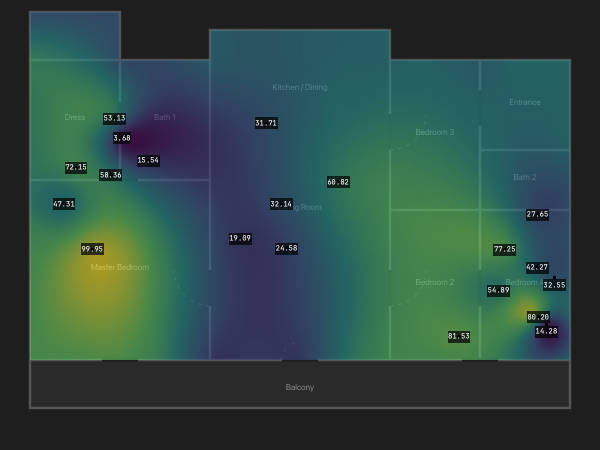

# FieldView

**FieldView** is a high-performance Python + Qt (PySide6) library for 2D data visualization, specifically designed for handling irregular data points. It provides a robust rendering engine for heatmaps, markers, and text labels with minimal external dependencies.



## Key Features

*   **Fast Heatmap Rendering**: Hybrid RBF (Radial Basis Function) interpolation for high-quality visualization with real-time performance optimization.
*   **Irregular Data Support**: Native handling of non-grid data points.
*   **Polygon Masking**: Support for arbitrary boundary shapes (Polygon, Circle, Rectangle) to clip heatmaps.
*   **Layer System**: Modular architecture with support for:
    *   **HeatmapLayer**: Color-based data visualization.
    *   **ValueLayer/LabelLayer**: Text rendering with collision avoidance.
    *   **PinLayer**: Marker placement.
    *   **SvgLayer**: Background floor plans or overlays.
*   **Minimal Dependencies**: Built on `numpy`, `scipy`, and `PySide6`.

## Installation

```bash
pip install fieldview
```

*Note: Requires Python 3.10+*

## Quick Start

Here is a minimal example to get a heatmap up and running:

```python
import sys
import os
import numpy as np
from PySide6.QtWidgets import QApplication, QGraphicsView, QGraphicsScene
from PySide6.QtCore import Qt
from fieldview.core.data_container import DataContainer
from fieldview.layers.heatmap_layer import HeatmapLayer
from fieldview.layers.text_layer import ValueLayer
from fieldview.layers.svg_layer import SvgLayer
from fieldview.layers.pin_layer import PinLayer

app = QApplication(sys.argv)

# 1. Setup Data
data = DataContainer()
np.random.seed(44)
points = (np.random.rand(20, 2) - 0.5) * 300
values = np.random.rand(20) * 100
data.set_data(points, values)

# 2. Create Scene & Layers
scene = QGraphicsScene()

# SVG Layer (Background)
# Assuming floorplan.svg exists in current dir or provide path
svg_layer = SvgLayer()
svg_layer.load_svg("examples/floorplan.svg")
svg_layer.setZValue(0)
scene.addItem(svg_layer)

# Heatmap Layer
heatmap = HeatmapLayer(data)
heatmap.setOpacity(0.6)
heatmap.setZValue(1)
heatmap.set_boundary_shape(svg_layer._bounding_rect)
scene.addItem(heatmap)

# Pin Layer
pin_layer = PinLayer(data)
pin_layer.setZValue(2)
scene.addItem(pin_layer)

# Value Layer
values_layer = ValueLayer(data)
values_layer.setZValue(3)
scene.addItem(values_layer)

# 3. Setup View
view = QGraphicsView(scene)
view.resize(800, 600)
view.show()

# Ensure content is visible
scene.setSceneRect(scene.itemsBoundingRect())
view.fitInView(scene.sceneRect(), Qt.AspectRatioMode.KeepAspectRatio)

sys.exit(app.exec())
```
≈

## Running the Demo

To see all features in action, including the property editor and real-time interaction:

```bash
# Clone the repository
git clone https://github.com/yourusername/fieldview.git
cd fieldview

# Run the demo using uv (recommended)
uv run examples/demo.py
```

## License

MIT License
