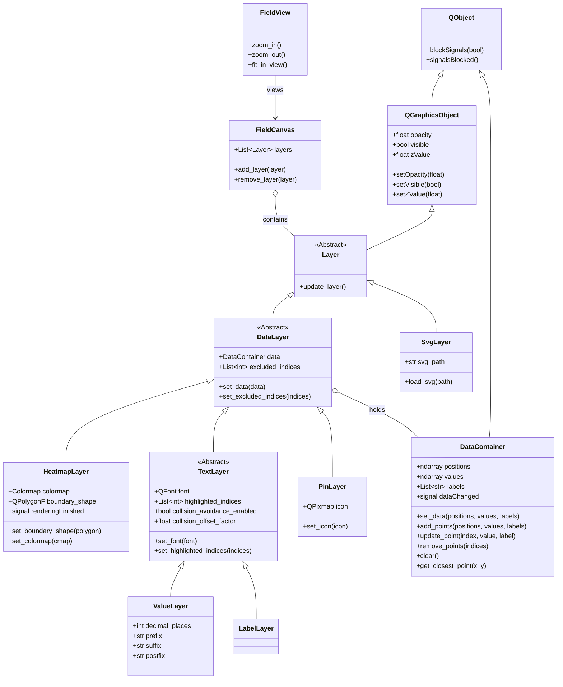

# FieldView

python + Qt based 2d data visualization solution

- Non-regular data point basis
- Fast heatmap which supports poligon based mask drawing


## Environment & Requirements

- **Package Manager**: `uv`
- **Python Version**: `3.10+`
- **GUI Framework**: `PySide6` (Primary), `QtPy` (for `PyQt6` compatibility)
- **Philosophy**: Minimal external dependencies


## Supported layers

- svg : drawing layer for prettry image masks
- heatmap : data layer for color-based visualization
  - Polygon mask support
  - Various color map support
- value : data layer for numerical values
  - Use with-fixed font (JetBrains Mono, minimal embedding)
  - Style: White text on Black background (adjustable opacity)
  - Can add suffix, postfix
  - Can adjust decimal placses
  - Highlight: Background color change
- label : data layer for text labels
  - Use with-fixed font (JetBrains Mono, minimal embedding)
  - Style: White text on Black background (adjustable opacity)
  - Highlight: Background color change
- pin : data layer that just showing location of point

## Project Structure

```
.
├── fieldview/
│   ├── __init__.py
│   ├── core/
│   │   ├── __init__.py
│   │   ├── data.py          # DataContainer model for efficient data handling
│   │   ├── layer.py         # Base class for all layers
│   │   └── signals.py       # Custom Qt signals for library-wide events
│   ├── layers/
│   │   ├── __init__.py
│   │   ├── data.py     # Abstract base class for data-driven layers
│   │   ├── svg.py           # SVG layer implementation
│   │   ├── heatmap.py       # Heatmap layer with polygon mask support
│   │   ├── text.py          # TextLayer, ValueLayer, LabelLayer
│   │   └── pin.py           # Pin/Point layer
│   ├── rendering/
│   │   ├── __init__.py
│   │   ├── canvas.py        # Main drawing canvas (QGraphicsScene subclass)
│   │   ├── view.py          # Viewport handling (QGraphicsView subclass)
│   │   └── colormaps.py     # Color mapping utilities for heatmap
│   └── ui/
│       ├── __init__.py
│       └── widget.py        # Main FieldView Qt Widget
├── tests/
│   ├── __init__.py
│   ├── test_core.py
│   ├── test_layers.py
│   └── test_rendering.py
└── examples/
    ├── demo.py              # Comprehensive demo with Property Editor
    ├── heatmap_demo.py      # Simple interactive heatmap demo
    ├── generate_data.py     # Data generation utility
    └── floorplan.svg        # Demo asset
```

## Key Components

### Core
- **`Layer`**: Abstract base class inheriting from `QGraphicsObject`.
- **`DataLayer`**: Abstract base class for layers that manage data.
- **`DataContainer`**: Model class for efficient data handling (Structure of Arrays).

### Layers
- **`HeatmapLayer`**:
  - Efficiently renders interpolated data.
  - Supports `set_mask(polygon)` to clip drawing.
  - Configurable `colormap`.
- **`SvgLayer`**:
  - Renders SVG content as a background or overlay.
- **`TextLayer`**:
  - Abstract base class for text rendering.
  - Font: JetBrains Mono (Minimal embedding).
  - Style: White text on Black background.
  - Properties: `font`, `opacity`, `highlighted_indices`.
- **`ValueLayer`**:
  - Renders numerical values.
  - Properties: `decimal_places`, `suffix`, `postfix`.
- **`LabelLayer`**:
  - Renders text labels.
- **`PinLayer`**:
  - Renders markers at specific coordinates.

### Rendering
- **`FieldCanvas` (QGraphicsScene)**: Manages all layer items.
- **`FieldView` (QGraphicsView)**: Handles zooming, panning, and interaction.

## Class Diagram



## Algorithm Policy

### Heatmap Extrapolation
- **Strategy**: Boundary Padding (Ghost Points)
- **Description**: To handle areas where the mask is larger than the data convex hull, "ghost points" are generated along the mask boundary. These points are assigned a default value (e.g., 0 or min_value) to ensure smooth interpolation towards the edges.

### Boundary Resolution
- **Strategy**: Adaptive Sampling based on Data Density
- **Description**: The resolution of the boundary (number of ghost points) is determined dynamically.
    - **Metric**: Average Nearest Neighbor Distance (ANND) of the data points.
    - **Target Length**: The boundary is discretized such that each segment length is approximately **1.0 ~ 1.5x ANND**.
    - **Application**: This applies to all mask shapes (Polygon, Circle, Rect) by approximating curves/lines as segmented polylines.

### Heatmap Interpolation
- **Strategy**: Hybrid RBF (Radial Basis Function)
- **Implementation**:
    - **Realtime Mode**:
        - Triggered during continuous interaction (e.g., dragging points).
        - Uses **Low-Resolution RBF** (1/10th grid size) for high performance.
        - Upscaled using `SmoothPixmapTransform` for visual continuity.
    - **High Quality Mode**:
        - Triggered automatically after **300ms** of inactivity (debounce timer).
        - Uses **Full-Resolution RBF** (`neighbors=30`, `kernel='thin_plate_spline'`).
        - Ensures maximum visual fidelity when static.
- **Parameters**:
    - `neighbors`: **30** (Default). Optimized for 60Hz rendering on a 200x200 grid.
    - `grid_size`: **300** (Default).

### Performance Monitoring
- **Render Time**: Exposed via `renderingFinished` signal in `HeatmapLayer`.
- **Demo**: Includes real-time render time display and noise simulation for stress testing.

